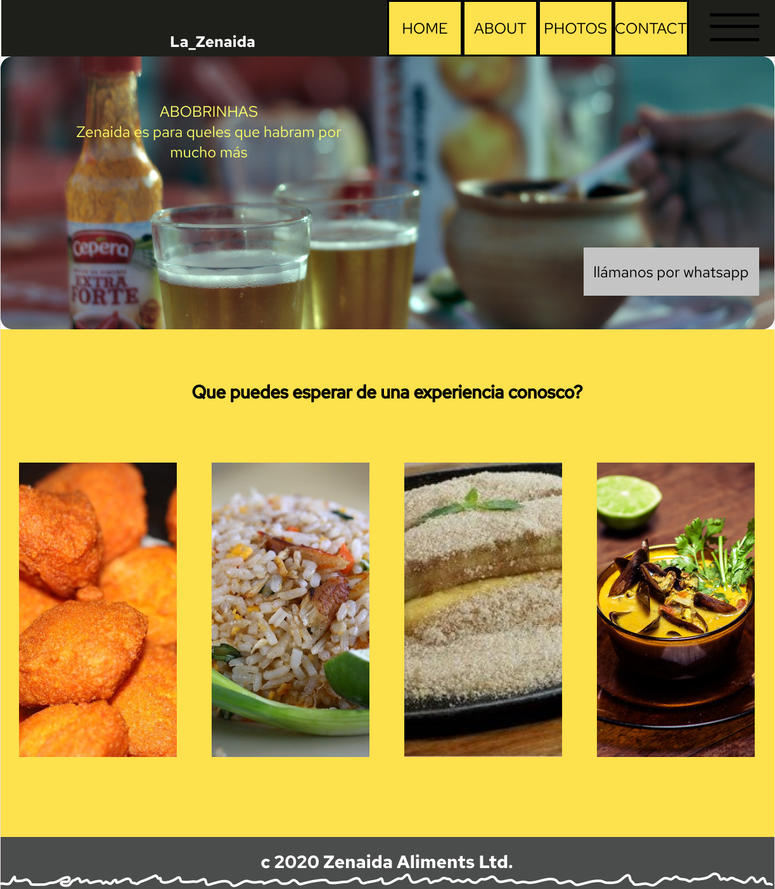
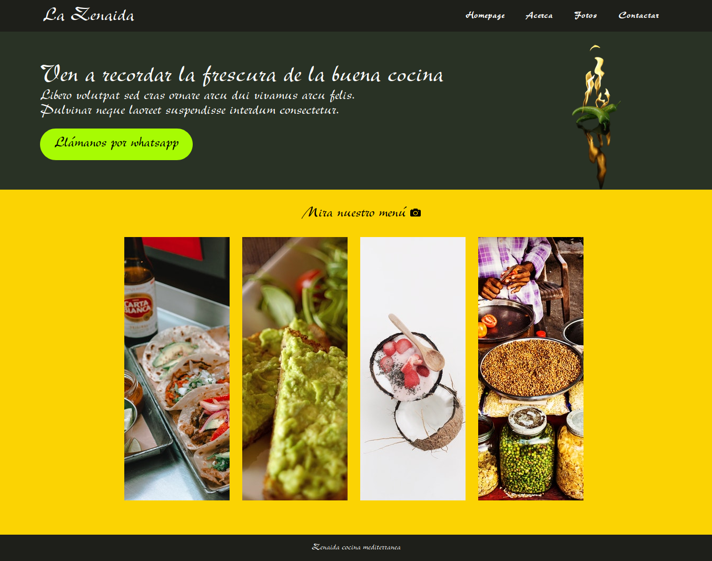

# Sobre este documento

Irá sintetizar o material contido no documento HTML e explicar propriedades relacionadas ao código-fonte relacionado.

## Sobre o que aprendemos até aqui

Vamos usar o layout de inspiração deste projeto como um exemplo.

Uma página web se trata de retângulos dentro de retângulos. Podemos abstrair cada elemento, ou conjunto de elementos, como uma *div*.

Os próximos tópicos irão apresentar o briefing do projeto desenvolvido.

### La Zenaida: comida mediterrânea

Ideia original:

🠫

- - -

Resultado obtido:

🠫

- - -

Softwares utilizados:

- Figma
- Gimp
- Inkspace
- Repositórios de imagens sem royalties

### Aviso

O projeto é uma reprodução de um layout já pronto, com algumas modificações, e serviu apenas para fixação dos conceitos básicos de manipulação de elementos usando as tecnologias HTML e CSS.

Trata-se de um site estático com posicionamento pré-definido dos elementos, apropriado para telas com resolução de 1364x767.

#### Créditos

Abaixo são prestados os devidos créditos aos recursos utilizados no projeto.

Fonte utilizada é similar ao `New Berolina MT Std`.

`banner.png` 🠪 __Pixabay__ disponível [aqui](https://www.pexels.com/pt-br/foto/alimento-ardente-chama-chili-70842/)  
`culinaria-layout.png` 🠪 __Elaborado pelo autor__  
`inspiration-layout.png` 🠪 __Bonieky Lacerda__ material disponibilizado no curso PHP do Zero ao Profissional  
`inspiration-layout-divs.svg` 🠪 __Elaborado pelo autor__  
`menu-photos.png` 🠪 __veckingo__ disponível [aqui](https://pt.vecteezy.com/png/1198770-camera)  
`menu-pic01.jpg` 🠪 __Hana Brannigan__ disponível [aqui](https://www.pexels.com/pt-br/foto/comida-alimento-refeicao-placa-3642718/)  
`menu-pic02.jpg` 🠪 __Kasumi Loffler__ disponível [aqui](https://www.pexels.com/pt-br/foto/pao-comida-alimento-refeicao-3535380/)  
`menu-pic03.jpg` 🠪 __Daria Shevtsova__ disponível [aqui](https://www.pexels.com/pt-br/foto/alimento-amor-baga-bagas-1030973/)  
`menu-pic04.jpg` 🠪 __NEOSiAM 2020__ disponível [aqui](https://www.pexels.com/pt-br/foto/acao-alimento-apolice-comida-618491/)  
`webpage-final.png` 🠪 __Elaborado pelo autor__  
