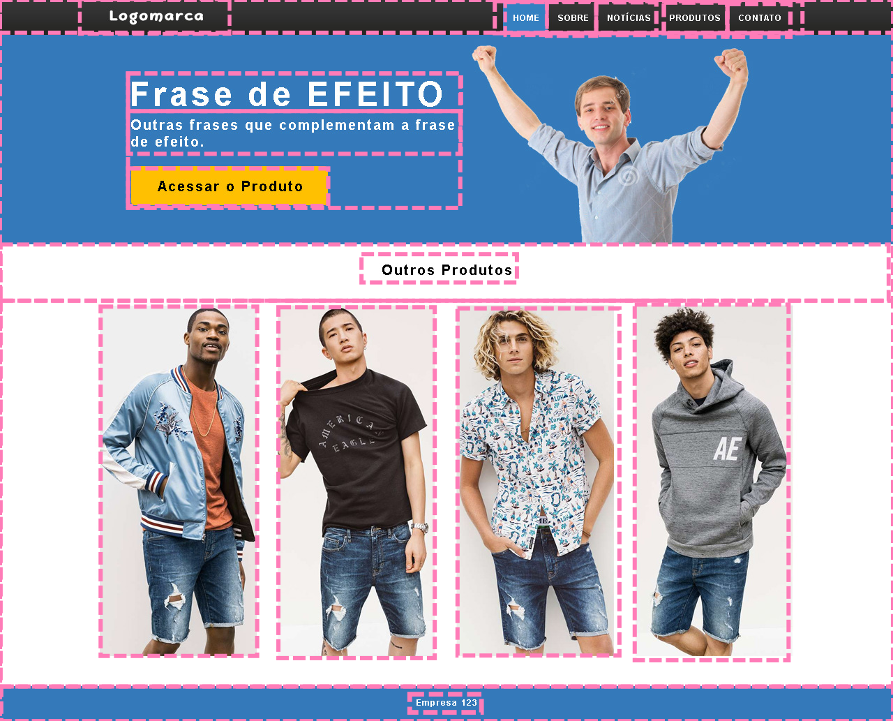

# Sobre este documento

Irá sintetizar o material contido no documento HTML e explicar propriedades relacionadas ao código-fonte relacionado.

## Sobre o que aprendemos até aqui

Vamos usar o layout de inspiração deste projeto como um exemplo.

Uma página web se trata de retângulos dentro de retângulos. Podemos abstrair cada elemento, ou conjunto de elementos, como uma *div*.

Os próximos tópicos irão apresentar o briefing do projeto desenvolvido.

### La Zenaida: comida mediterrânea

Softwares utilizados:

- Figma
- Gimp
- Inkspace
- Repositórios de imagens sem royalties

### Aviso

O projeto é uma reprodução de um layout já pronto, com algumas modificações, e serviu apenas para fixação dos conceitos básicos de manipulação de elementos usando as tecnologias HTML e CSS.

Trata-se de um site estático com posicionamento pré-definido dos elementos, apropriado para telas com resolução de 1364x767.
